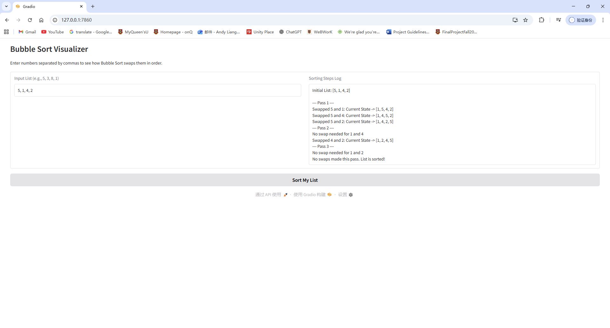
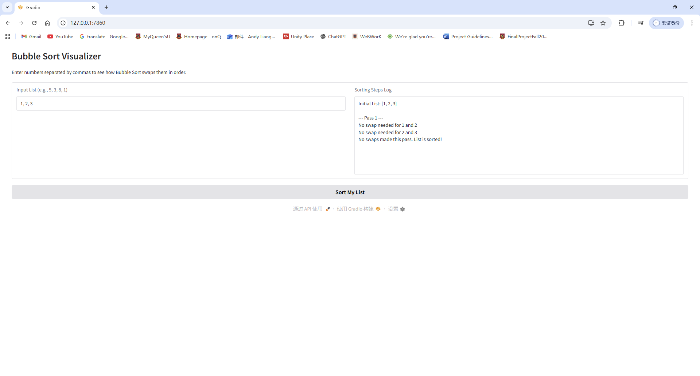
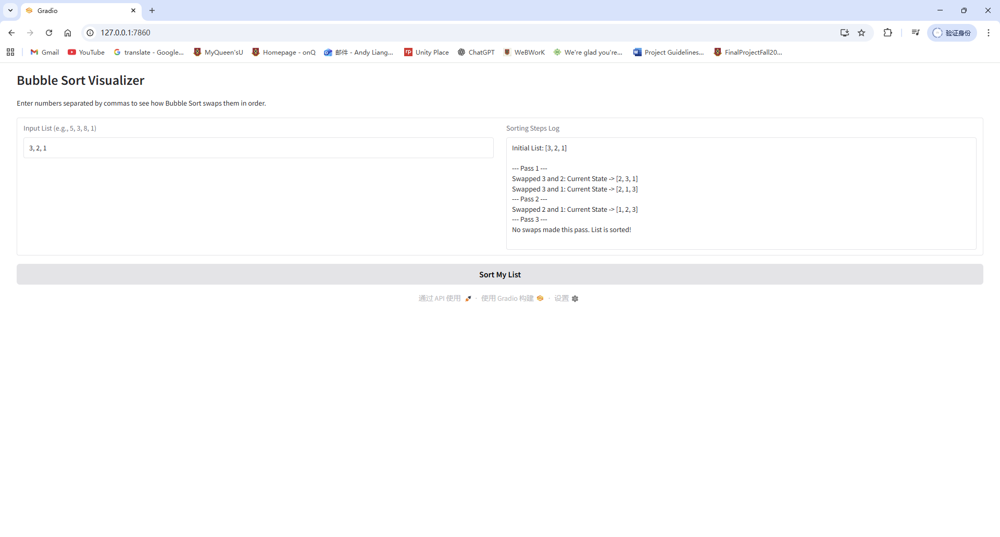
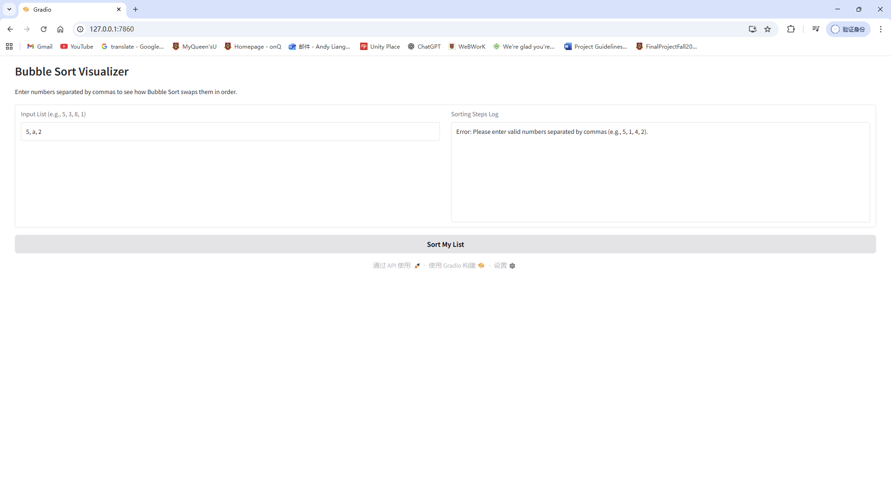

# Bubble Sort Visualizer

# Demo

# Problem Breakdown & Computational Thinking
    To build this app, I used the four pillars of computational thinking:

* **Decomposition:** I broke the sorting process down into small steps: parsing the user input, looping through the list, comparing two neighbors, and swapping them if they are in the wrong order.
* **Pattern Recognition:** I noticed that in Bubble Sort, large numbers "bubble" to the top (end of the list) through repeated swaps. This pattern repeats until the list is sorted.
* **Abstraction:** I hid the complex Python logic (loops and memory assignment) behind a simple "Sort My List" button so the user only worries about the numbers they want to sort.
* **Algorithm Design:** 1. Input: Take a string of numbers.
                        2. Process: Compare adjacent numbers -> Swap if needed -> Repeat.
                        3. Output: A text log showing exactly which numbers moved.

# Steps to Run
1. Install requirements: gradio
2. Run the app in terminal
3. Open the link displayed in the terminal

# Testing & Verification
    I verified the algorithm works by testing these specific cases:
* **Random order:** Input `5, 1, 4, 2` -> Result `1, 2, 4, 5`.
* **Already sorted:** Input `1, 2, 3` -> App knows no swaps are needed.
* **Reverse order:** Input `3, 2, 1` -> Swapped every element correctly.
* **Error Handling:** Input `5, a, 2` -> App displayed a  error message.

# Hugging Face Link
https://huggingface.co/spaces/andy2200159/bubble_sort_simulation

# Author & Acknowledgment

Created for CISC-121 Project.
